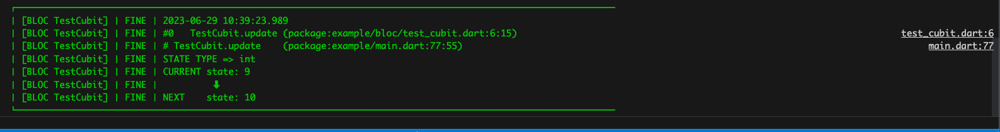

## Color logger 

* sample =>example/lib/main.dart
* Setup
``` dart
  Logger.root.onRecord.listen(ColorLogger.output);
  // show stack trace
  // if use 'flutter build apk --obfuscate  ' trace will failed, 
  // set ColorObserverLogger.logStack = false ;
  ColorObserverLogger.logStack = false;

```
* Observer bloc
```dart 
  Bloc.observer = ColorBlocObserver();

```

* bloc 
    * untrack
        
    * track
         
    * error
        
    * error track
        

* cubit
    * untrack
        
    * track
        

  