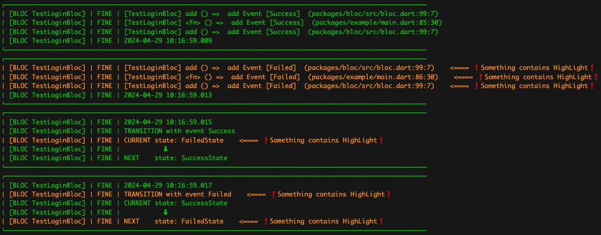
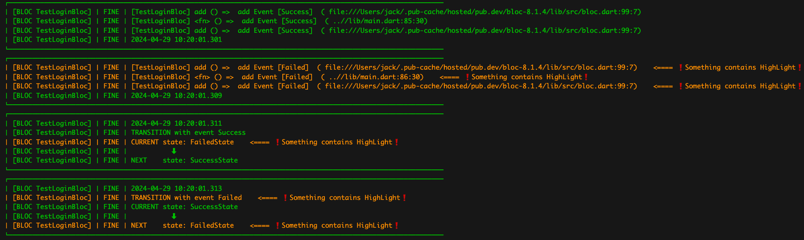

## Color logger 

More examples you can get [here](https://github.com/jack-fan1991/flutter_color_observer_logger/blob/main/example/lib/main.dart)


#### Work with vscode extension for help 
* [Vscode extension flutter logger easy life](https://marketplace.visualstudio.com/items?itemName=jackFan.lazy-jack-flutter-logger-easy-life)

* without extension

* with extension you can tap absolute path to code line



#### Setup Observer bloc
* [more](example/lib/main.dart) 
``` dart
    // show stack trace
    // if use 'flutter build apk --obfuscate  
    // set stackTracking = false ;

    //AnsiColor.showColor();
    Logger.root.level = Level.ALL;
    Bloc.observer = ColorBlocObserver(
      stackTracking: true,
      kIsWeb: kIsWeb,
      filter: ShowWhenFilter(
        [
          "TestLoginBloc",
          "TestCubit",
        ],
      ),
      blocColor: AnsiColor.fg(40),
      methodCount: 3,
      blocHighLightFilter: DefaultHighLightFilter(
        color: AnsiColor.fg(214),
        colorOnly: false,
      ),
    );
    
```
#### Logger filter
* [more](lib/src/logger_filter.dart) 
* Trigger when string contains

``` dart
   class ShowWhenFilter extends Filter {
        ShowWhenFilter(List<String> name) : super(name);
    }    

    class HideWhenFilter extends Filter {
        HideWhenFilter(List<String> name) : super(name);
    }

```

### HighLightFilter 
* [more](lib/src/bloc_hight_light_filter.dart) 
*  Highlight message with color when filter return true

```dart
class DefaultHighLightFilter extends BlocHighLightFilter {
  @override
  bool filter(String message) {
    return message.toLowerCase().contains('error') ||
        message.toLowerCase().contains('fail') ||
        message.toLowerCase().contains('exception');
  }
}


```


* bloc 

    * untrack
        
    * track
        
        
    * error
        
    * error track
        

* cubit
    * untrack
        
    * track
        

  